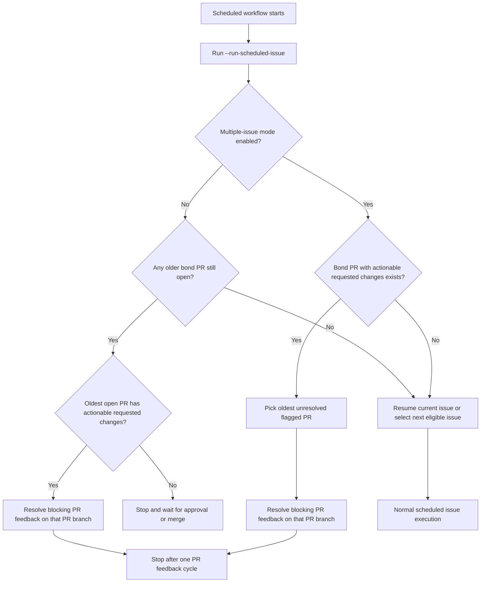

# Scheduled PR Feedback Priority

## Problem Frame

`--run-scheduled-issue` currently resumes or selects issue work first. The generated workflow in `src/bond.rs` then commits and either reuses or creates a PR for that issue branch, but the scheduled path does not first inspect open bond-created PRs for outstanding requested changes.

That creates a gap in the automation loop: the bond can continue opening or advancing new issue work while older bond PRs still contain unresolved reviewer feedback. The desired behavior is to make PR feedback resolution a guaranteed part of scheduled execution, not an advisory preference tucked into `.bond/IDENTITY.md` or `.bond/PERSONALITY.md`.

## Requirements

**Priority Policy**

- R1. Scheduled automation must inspect bond-opened pull requests for actionable requested changes before it begins new issue work.
- R2. This check must be part of the enforced `--run-scheduled-issue` execution path or a directly coupled preflight for that path, not only a prompt instruction in `.bond/IDENTITY.md` or `.bond/PERSONALITY.md`.
- R3. If one or more bond-opened PRs have actionable requested changes, scheduled automation must prioritize PR feedback work over selecting or resuming a new issue.

**What Counts As Actionable Feedback**

- R4. Actionable feedback is limited to PR feedback that explicitly requests changes, not every PR comment or general discussion message.
- R5. Informational comments, approvals, or non-blocking conversation must not by themselves divert scheduled automation away from issue work.
- R6. The system must use a deterministic rule to identify whether a bond-opened PR is still awaiting requested changes.

**Backlog Selection**

- R7. When multiple bond-opened PRs need changes, scheduled automation must choose the oldest unresolved actionable PR first.

**Multiple-Issue Mode**

- R8. Scheduled automation must expose a repository-level setting that controls whether it may continue working on additional issues while older bond PRs remain open.
- R9. This setting must default to false.
- R10. When this setting is false, scheduled automation must treat the oldest still-open bond PR as the active item and must not begin or resume new issue work until that PR is merged or otherwise no longer open.
- R11. When this setting is false and the active open bond PR has actionable requested changes, scheduled automation must spend the run resolving that PR feedback on the PR branch.
- R12. When this setting is false and the active open bond PR has no remaining actionable requested changes but is still awaiting approval or merge, scheduled automation must stop without selecting or resuming another issue.
- R13. When this setting is true, scheduled automation may continue to the next eligible issue only after any bond PRs with actionable requested changes have been serviced according to the PR-feedback priority rules.

**Execution Behavior**

- R14. A single scheduled run must handle at most one PR feedback cycle before stopping; it must not continue on to additional PRs or new issue work in the same run after that PR-feedback cycle.
- R15. When scheduled automation selects PR feedback work, it must build the run around addressing the reported review issues on that PR's branch instead of the normal next-issue selection flow.
- R16. The automation must attempt to resolve the reported problems and leave the PR branch updated for another review cycle.
- R17. If no actionable requested changes exist on any bond-opened PR, scheduled automation must either continue the existing issue-driven behavior or stop, depending on the multiple-issue setting and whether an older bond PR is still open awaiting merge.

**Visibility And Safety**

- R18. Scheduled runs must make it clear in their logs or journal whether they are handling PR feedback work, waiting on an open PR to be merged, or doing normal issue work.
- R19. The behavior must preserve the existing safeguard that scheduled automation does no work when autonomous execution is disabled.
- R20. The design must avoid silently losing track of the issue currently stored in `.bond/state.yml` when a scheduled run detours into PR feedback work.

## Success Criteria

- Bond-created PRs with explicit requested changes are revisited before the scheduler starts new issue work.
- A maintainer can rely on `--run-scheduled-issue` to treat unresolved review feedback as first-class scheduled work, not as a best-effort prompt hint.
- The scheduler processes PR feedback in a predictable order and does not mix PR-feedback work with new issue work in the same run.
- With multiple-issue mode disabled, the scheduler does not advance to new issue work while any older bond PR remains open and unmerged.
- With multiple-issue mode enabled, the scheduler may continue to new issue work only after any merge-blocking requested changes on older bond PRs have been addressed.

## Scope Boundaries

- Non-bond PRs are out of scope.
- General PR conversation that does not explicitly request changes is out of scope.
- Draining multiple PR feedback items in one run is out of scope.
- Redesigning the overall issue selection algorithm is out of scope except where needed to defer it behind PR feedback priority and single-vs-multiple-issue mode.

## Key Decisions

- Enforce in scheduled execution, not prompt text: the requirement is reliability, so this must live in or directly around the `--run-scheduled-issue` path rather than relying on agent obedience to prompt wording.
- Repo-wide PR backlog, not only current issue PR: the scheduler should treat bond-opened PR feedback as a repository backlog that can block new issue intake.
- Requested-changes only: this keeps the policy focused on merge-blocking feedback instead of turning every comment into scheduled work.
- Default to single-issue mode: by default the scheduler should keep one bond PR in flight until it is merged rather than opening parallel issue streams.
- One PR per run: this keeps each scheduled run bounded and auditable.
- Oldest unresolved PR first: this reduces stale review debt and gives the backlog a deterministic ordering.

## Dependencies / Assumptions

- Verified current behavior: `src/commands.rs` currently resumes `current_issue` or selects the next eligible issue in `prepare_scheduled_issue_prompt()` and does not inspect PR review state first.
- Verified current workflow behavior: `src/bond.rs` currently reuses or creates PRs during the generated GitHub Actions workflow, but only after scheduled issue execution has already happened.
- Unverified implementation choice: the exact GitHub query shape for detecting requested changes is deferred to planning.
- Assumption introduced by this brainstorm: whether multiple issues may be worked in parallel should be controlled by an explicit repository setting rather than inferred from PR state alone.

## Outstanding Questions

### Deferred to Planning

- [Affects R6][Needs research] What is the most reliable technical signal for "actionable requested changes" across GitHub review states and comments while keeping false positives low?
- [Affects R8][Technical] What should the repository setting be called in `.bond/config.yml`, and where should it live within the automation configuration?
- [Affects R12][Needs research] What is the most reliable technical signal for "open but still waiting for approval or merge" so single-issue mode can stop without accidentally advancing?
- [Affects R15][Technical] Should PR feedback work be represented as a new execution prompt mode, or should the existing issue execution prompt be extended to include PR-review remediation context?
- [Affects R18][Technical] What repository state, if any, should be persisted so the scheduler can explain that it temporarily prioritized a PR feedback cycle or stopped behind an unmerged PR?
- [Affects R20][Technical] How should the runtime preserve or restore `current_issue` and `last_issue` when the scheduled run temporarily switches from issue work to a PR-feedback branch?

## Next Steps

→ /ce-plan for structured implementation planning
