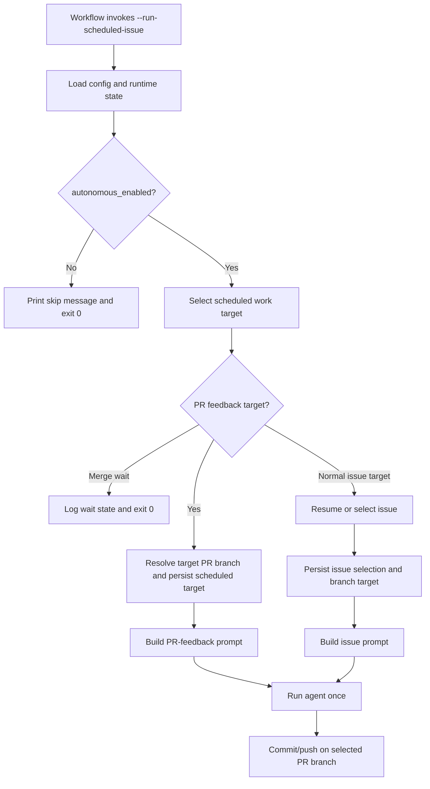

# feat: Scheduled PR feedback priority

## Overview

Add a scheduled-work prioritization layer so `--run-scheduled-issue` handles bond PR review debt before it opens or resumes new issue work. The new behavior must also support a repository-level multi-issue mode flag: by default scheduled automation keeps one bond PR in flight until it is merged, while opt-in multi-issue mode allows additional issue work only after any merge-blocking requested changes on older bond PRs have been addressed.

## Problem Frame

The current scheduled path is issue-first. `src/main.rs` calls `commands::prepare_scheduled_issue_prompt(...)`, which only resumes `current_issue` or selects the next eligible issue. The generated workflow in `src/bond.rs` then resumes an issue branch from `.bond/state.yml`, runs `--run-scheduled-issue`, verifies changes, commits, and either reuses or creates a PR. There is no preflight that inspects bond-created PRs for reviewer-requested changes, no mode that pauses behind an open unmerged PR, and no persisted concept of scheduled work that is distinct from `current_issue`. The origin requirements now establish two policies that planning must preserve together: unresolved requested changes on bond PRs take priority over new issue work, and single-issue mode is the default until an operator explicitly opts into parallel issue streams (see origin: `docs/brainstorms/2026-04-06-scheduled-pr-feedback-priority-requirements.md`).

## Requirements Trace

- R1-R3. Scheduled execution must inspect bond-opened PRs and prioritize actionable requested changes ahead of new issue work.
- R4-R7. Actionable feedback means explicit requested changes only, selected with a deterministic oldest-first rule.
- R8-R13. Add a repository-level multi-issue mode flag, default `false`, that blocks new issue work behind the oldest open bond PR unless the operator enables multi-issue mode.
- R14-R17. One scheduled run handles at most one PR-feedback cycle, otherwise continues or stops according to mode and open-PR state.
- R18-R20. Logs and journal output must distinguish PR feedback work, merge-wait pauses, and normal issue work while preserving the existing autonomous-enabled gate and current issue state safety.

## Scope Boundaries

- No support for non-bond PRs.
- No attempt to drain more than one PR feedback item in a single scheduled run.
- No change to the interactive `/issues ...` command surface unless a helper can be reused without altering interactive behavior.
- No redesign of the overall issue ranking algorithm beyond deferring it behind PR-feedback and merge-wait policy.
- No broad GitHub review dashboard or generalized PR triage subsystem; the scope is limited to the scheduled automation path and the persisted state needed to support it.

## Context & Research

### Relevant Code and Patterns

- `src/main.rs` owns the top-level `args.run_scheduled_issue` branch and already enforces the `autonomous_enabled` gate before calling into scheduled selection logic.
- `src/commands.rs` owns `prepare_scheduled_issue_prompt`, issue selection, persisted `current_issue` lifecycle, journal writes, GitHub issue loading, and the current user-visible setup/status surfaces.
- `src/bond.rs` owns `AutomationSettings`, `BondState`, `BondConfig`, `.bond` bootstrap defaults, state persistence helpers, and the generated GitHub Actions workflow in `default_bond_workflow_contents`.
- The generated workflow currently resumes an issue branch by scraping `.bond/state.yml` for `current_issue` or `last_issue`, then calls `./.bond/bin/doublenot-bond --repo . --run-scheduled-issue`, then commits using issue-derived branch metadata.
- `tests/commands.rs` already covers scheduled-run behavior, workflow generation assertions, setup/status output, and fake-`gh` integration patterns that can be extended for PR-review discovery.
- `tests/bootstrap.rs` already verifies automation config defaults and is the right place to assert the new flag bootstrap default.

### Institutional Learnings

- Repo memory notes only that scheduled workflow generation lives in `src/bond.rs`, issue execution prompt building lives in `src/commands.rs`, and workflow expectations are already covered in `tests/commands.rs`.
- No `docs/solutions/` entry or prior repo note exists for PR-review prioritization, multi-issue automation policy, or scheduler-side PR state selection.

### External References

- External research was skipped for the plan itself. The existing repository already uses `gh` in the generated workflow and has local patterns for GitHub issue integration. The exact GitHub CLI query shape for requested-changes and merge-wait detection remains a planning-owned design question carried into the implementation units rather than a product blocker.

## Key Technical Decisions

- Add a boolean operator-facing config flag in `automation` rather than inferring policy from open PR count. Use `automation.multiple_issues` with default `false` to match the requirements language and keep the policy close to existing scheduled automation settings.
- Keep the prioritization guarantee in the scheduled execution path, not in prompt text or workflow-only heuristics. The selection contract should live in or directly behind `--run-scheduled-issue` so local and GitHub Actions scheduled runs share the same decision logic.
- Introduce an explicit scheduled-work selection model instead of overloading `current_issue`. The scheduled path now needs to represent at least three outcomes: PR feedback work, merge-wait stop, and normal issue work. A dedicated scheduled target/state shape is safer than mutating issue-selection state to impersonate older PRs.
- Move branch targeting to scheduled-runtime logic, then teach the workflow commit step to honor persisted scheduled target metadata. The current workflow assumes branch choice can be derived only from `current_issue` or `last_issue`, which is insufficient for older PR-feedback work and merge-wait scenarios.
- Preserve current issue state as an operator-facing issue stack, not as a generic “whatever the scheduler touched last” register. Scheduled PR-feedback detours should either snapshot and restore issue context explicitly or avoid mutating it at all.
- Use deterministic PR selection with explicit tie-breaks. “Oldest unresolved actionable PR first” should be implemented as a stable total order, not just a loose bucket rule, so repeated scheduler runs do not drift based on API return order.

## Open Questions

### Resolved During Planning

- Where should the new mode flag live? In `BondSettings.automation` as `multiple_issues: bool`, because it is part of scheduled automation policy rather than mutable runtime state.
- Should single-issue mode pause behind an open PR even after requested changes are resolved? Yes; that stop state is a first-class scheduler outcome and should be modeled explicitly rather than treated as “no eligible issue.”
- Should the plan mutate `current_issue` to represent PR-feedback work on older issue branches? No; the runtime should track scheduled target selection separately so operator issue state remains trustworthy.
- Should one run ever both fix PR feedback and then continue to issue work? No; after one PR-feedback cycle the run stops regardless of mode, matching the origin document.

### Deferred to Implementation

- Which `gh` query shape most reliably identifies requested-changes backlog and “open but waiting for approval/merge” state with low false positives.
- Whether scheduled-target persistence belongs in `.bond/state.yml` as a durable field or in a tightly scoped transient artifact written and consumed within one run.
- Whether PR-feedback prompt construction should be a dedicated builder or a structured extension of the existing issue execution prompt builder.

## High-Level Technical Design

> This illustrates the intended approach and is directional guidance for review, not implementation specification. The implementing agent should treat it as context, not code to reproduce.

### Policy Matrix

| Mode                      | Oldest bond PR state                    | Scheduled result                 |
| ------------------------- | --------------------------------------- | -------------------------------- |
| `multiple_issues = false` | Open with requested changes             | Fix that PR only                 |
| `multiple_issues = false` | Open without requested changes          | Stop and wait for merge/approval |
| `multiple_issues = false` | No open bond PR                         | Resume or select next issue      |
| `multiple_issues = true`  | Any bond PR with requested changes      | Fix oldest actionable PR only    |
| `multiple_issues = true`  | Open PRs without requested changes only | Resume or select next issue      |
| `multiple_issues = true`  | No open bond PR                         | Resume or select next issue      |

## Implementation Units

- [x] **Unit 1: Add automation policy plumbing for multi-issue mode**

**Goal:** Introduce the repository-level scheduler flag and make its default visible in bootstrap output, config loading, and operator status surfaces.

**Requirements:** R8-R13, R18

**Dependencies:** None

**Files:**

- Modify: `src/bond.rs`
- Modify: `src/commands.rs`
- Test: `tests/bootstrap.rs`
- Test: `tests/commands.rs`
- Modify: `README.md`
- Modify: `docs/workflows.md`

**Approach:**

- Extend `AutomationSettings` with `multiple_issues: bool` plus a `false` default and bootstrap rendering support.
- Surface the value in `/status` and `/setup status` alongside the other automation settings.
- Update docs and examples so operators understand the single-issue default and the opt-in meaning of the flag.
- Preserve backward compatibility for existing repos whose config omits the field by defaulting to `false` on read.

**Patterns to follow:**

- Existing automation config defaults in `src/bond.rs`
- Existing status output patterns in `src/commands.rs`
- Existing config bootstrap assertions in `tests/bootstrap.rs`

**Test scenarios:**

- Happy path: a fresh bootstrap writes `automation.multiple_issues: false` in `.bond/config.yml`.
- Happy path: `/status` and `/setup status` print the configured mode value.
- Edge case: legacy configs without the new field still load and behave as single-issue mode.
- Documentation parity: README and workflows docs describe the default and opt-in behavior consistently.

**Verification:**

- A newly bootstrapped repo defaults to single-issue mode, and operator-facing status surfaces expose the setting without requiring manual config migration.

- [x] **Unit 2: Introduce scheduled PR backlog discovery and selection**

**Goal:** Build a deterministic scheduler pre-selection layer that can classify bond PRs into actionable-feedback, merge-wait, or non-blocking states before normal issue selection.

**Requirements:** R1-R7, R10-R13, R17

**Dependencies:** Unit 1

**Files:**

- Modify: `src/commands.rs`
- Test: `tests/commands.rs`

**Approach:**

- Add a scheduled-work selector that queries GitHub for bond PRs, normalizes their relevant review state, and returns a stable oldest-first target when requested changes remain.
- Teach the selector to distinguish actionable requested changes from merge-wait states where the PR is still open but no longer blocked by requested changes.
- Keep the single-issue and multi-issue mode rules in the selector result so downstream execution only consumes a structured decision.
- Reuse existing fake-`gh` test patterns so PR backlog discovery can be characterized with deterministic fixtures.

**Patterns to follow:**

- GitHub issue detection and fake-`gh` test setup already used in `tests/commands.rs`
- Existing scheduled-run gate in `src/main.rs` and issue-selection logic in `prepare_scheduled_issue_prompt`

**Test scenarios:**

- Happy path: oldest PR with requested changes wins over newer actionable PRs.
- Happy path: multi-issue mode ignores open PRs that have no blocking requested changes and falls through to issue selection.
- Edge case: single-issue mode stops behind an older open PR that has no requested changes but is still unmerged.
- Edge case: no bond PR backlog falls through to the current issue-first behavior unchanged.
- Error path: malformed or partial GitHub CLI responses fail safely with clear operator-facing errors rather than silently opening new issue work.

**Verification:**

- Scheduled selection produces a deterministic one-run target and enforces the single-issue vs multi-issue policy before issue selection begins.

- [x] **Unit 3: Add scheduled target state and prompt modes**

**Goal:** Represent PR-feedback work and merge-wait pauses explicitly so the runtime can execute or stop without corrupting `current_issue` / `last_issue` semantics.

**Requirements:** R14-R20

**Dependencies:** Unit 2

**Files:**

- Modify: `src/bond.rs`
- Modify: `src/commands.rs`
- Modify: `src/main.rs`
- Test: `tests/commands.rs`

**Approach:**

- Add a scheduled target model that can encode at least: normal issue work, PR feedback work, merge-wait stop, and no-work.
- Persist only the minimum metadata needed for journaling, branch targeting, and commit/push steps without repurposing `current_issue` as a generic scheduled target.
- Extend the scheduled run path so `main.rs` dispatches on the scheduled target type rather than assuming every successful selection returns an issue prompt.
- Add a PR-feedback prompt builder that frames the selected PR, review requests, and expected remediation work, while preserving the existing issue prompt path for normal issue execution.

**Patterns to follow:**

- `BondState` mutation helpers in `src/bond.rs`
- Existing issue prompt construction and journal-entry patterns in `src/commands.rs`
- Existing autonomous-enabled skip behavior in `src/main.rs`

**Test scenarios:**

- Happy path: PR-feedback selection writes a journal entry that clearly says scheduled PR feedback work started.
- Happy path: merge-wait selection exits successfully with a visible “waiting for merge or approval” message and no agent run.
- Edge case: current issue state remains intact after a PR-feedback detour and is still available when the scheduler later returns to issue work.
- Edge case: no-work and issue-work outcomes continue to preserve the current scheduled issue behavior.

**Verification:**

- The runtime has a first-class representation of PR-feedback and merge-wait outcomes, and issue state remains trustworthy across detours.

- [x] **Unit 4: Align branch checkout, commit, and PR reuse with scheduled target selection**

**Goal:** Ensure the generated GitHub Actions workflow and commit step operate on the selected scheduled target branch rather than assuming branch metadata always comes from `current_issue` / `last_issue`.

**Requirements:** R2, R10-R18

**Dependencies:** Unit 3

**Files:**

- Modify: `src/bond.rs`
- Test: `tests/commands.rs`
- Modify: `docs/workflows.md`

**Approach:**

- Update the generated workflow contract so the runtime-selected scheduled target controls branch checkout and commit behavior.
- Replace or narrow the current shell logic that scrapes `.bond/state.yml` for `current_issue` / `last_issue` when that is insufficient for older PR-feedback branches.
- Keep PR creation/reuse bounded: PR-feedback runs should update an existing PR branch and stop, while normal issue work can still create a new PR when needed.
- Make merge-wait runs exit before verification/commit when they intentionally made no code changes.

**Patterns to follow:**

- Existing workflow generation in `default_bond_workflow_contents`
- Existing workflow-generation assertions in `tests/commands.rs`

**Test scenarios:**

- Happy path: generated workflow contains the new branch-targeting contract for scheduled work.
- Happy path: PR-feedback runs reuse an existing PR instead of attempting to create another one.
- Edge case: merge-wait runs produce no commit, no PR creation, and no verification failure from an unchanged worktree.
- Edge case: normal issue runs continue to create or reuse PRs exactly as they do today when no PR-feedback backlog blocks them.

**Verification:**

- The workflow and runtime share a consistent branch-target contract for scheduled work, including older PR-feedback branches and merge-wait no-op runs.

- [x] **Unit 5: Expand scheduled-run coverage and operator documentation**

**Goal:** Lock the new scheduler policy into tests and docs so future automation changes do not regress into issue-first behavior.

**Requirements:** R1-R20

**Dependencies:** Units 1-4

**Files:**

- Modify: `tests/commands.rs`
- Modify: `README.md`
- Modify: `docs/workflows.md`

**Approach:**

- Add integration-style command tests that cover the policy matrix for single-issue and multi-issue modes using fake `gh` responses.
- Document the scheduler order of operations, the meaning of `multiple_issues`, and the fact that a clean-but-unmerged older bond PR blocks new issue work in single-issue mode.
- Make the docs explicit that PR feedback priority is enforced by scheduled execution, not by prompt personality.

**Patterns to follow:**

- Existing command integration tests in `tests/commands.rs`
- Existing scheduled automation docs in `README.md` and `docs/workflows.md`

**Test scenarios:**

- Happy path: single-issue mode fixes oldest blocking PR feedback and stops.
- Happy path: single-issue mode stops behind an open PR with no requested changes and does not start a new issue.
- Happy path: multi-issue mode falls through to issue selection after older PRs are no longer blocked by requested changes.
- Edge case: multiple blocking PRs are processed oldest-first across repeated runs, one PR per run.
- Edge case: autonomous-disabled mode still short-circuits before any PR or issue selection work.

**Verification:**

- The policy matrix is covered by tests and the operator docs describe the same behavior the runtime enforces.

## System-Wide Impact

- **Control-flow impact:** The scheduled path stops being issue-first and becomes a mode-aware scheduler that can select PR feedback, merge-wait, or normal issue work.
- **State impact:** `.bond/state.yml` needs a way to carry scheduled-target metadata without weakening the meaning of `current_issue` and `last_issue`.
- **Workflow impact:** `.github/workflows/bond.yml` will depend on runtime-selected target metadata instead of only current/last issue scraping.
- **CLI/API surface:** `.bond/config.yml` gains a new automation policy flag with an external CI consumer because generated workflow behavior changes based on it.
- **Testing impact:** `tests/commands.rs` becomes the primary integration suite for PR-feedback selection, mode behavior, and workflow generation assertions.

## Risks & Dependencies

| Risk                                                                      | Mitigation                                                                                                         |
| ------------------------------------------------------------------------- | ------------------------------------------------------------------------------------------------------------------ |
| PR feedback selection drifts from actual merge-blocking GitHub state      | Characterize the `gh` response shape in tests first and keep the selection logic behind a single classifier helper |
| Single-issue mode accidentally advances to new work behind an unmerged PR | Model merge-wait as an explicit scheduled outcome and test it directly                                             |
| Older PR-feedback work corrupts `current_issue` / `last_issue` semantics  | Introduce dedicated scheduled-target metadata rather than overloading issue state                                  |
| Workflow branch selection and runtime target selection disagree           | Make one target contract authoritative and assert it in workflow-generation tests plus scheduled-run tests         |
| Boolean mode naming becomes unclear to operators                          | Document the policy in README and workflows docs and expose it in `/status` and `/setup status`                    |
