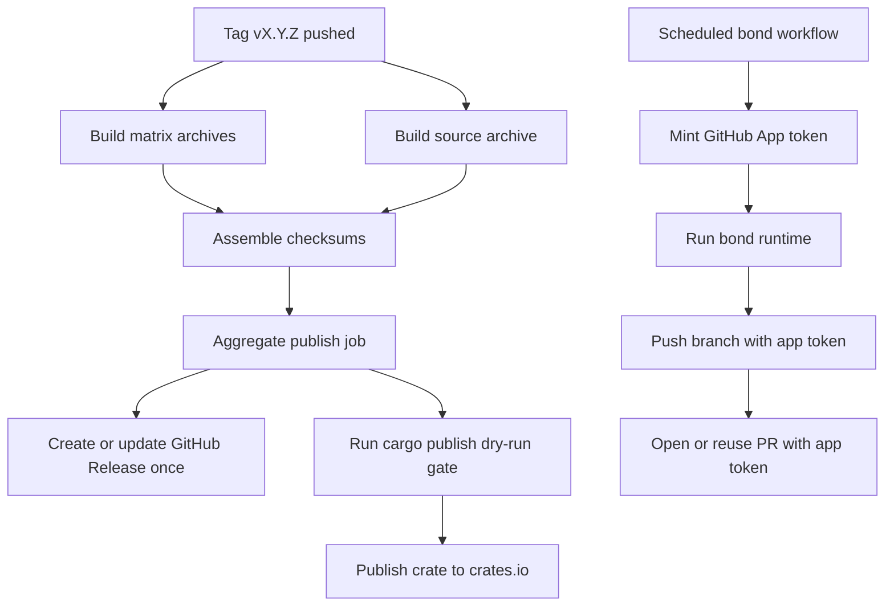

# feat: Bot identity and release publication

## Overview

Fix two adjacent automation gaps in this repository.

First, the generated bond workflow currently brands git commits as `doublenot-bond[bot]` but authenticates remote writes with `GITHUB_TOKEN`, so pushes and `gh pr create` activity still appear as `github-actions[bot]`. Second, the release workflow already builds and uploads artifacts, but release creation is spread across jobs and there is no crates.io publication path. The plan is to give bond write operations a real Doublenot-controlled GitHub identity, centralize GitHub Release publication into one job, and add a gated crates.io publish path plus stronger release-readiness validation.

## Problem Frame

The origin requirements document defines two outcomes: bond automation should use a consistent remote identity for user-visible GitHub writes, and tagged releases should reliably produce both a visible GitHub Release and a crates.io publication. Repo research shows those concerns land in different seams:

- `src/bond.rs` renders `.github/workflows/bond.yml` as a string template and currently hardcodes `GH_TOKEN: ${{ secrets.GITHUB_TOKEN }}` for scheduled workflow writes.
- `tests/commands.rs` already verifies generated workflow content through `/setup workflow refresh`, so bond identity changes can be covered there.
- `.github/workflows/release.yml` is hand-authored and currently runs `softprops/action-gh-release@v2` in multiple jobs while never invoking `cargo publish`.
- `scripts/release-dry-run.sh`, `Makefile`, and `.github/workflows/ci.yml` already provide a release-readiness lane that can be extended to catch crates.io packaging failures before a tag is cut.

The plan intentionally keeps the identity scope narrow: the priority surfaces are the scheduled bond PR opener and branch push actor, followed by commit author metadata. It does not attempt to rebrand every GitHub Actions surface in the repository.

## Requirements Trace

- R1-R3. Bond workflow write operations must use a consistent Doublenot-controlled identity with documented credential setup and failure behavior.
- R4-R6. Tagged releases must create a visible GitHub Release, publish the crate to crates.io, and make failure phases obvious.
- R7-R8. Docs must describe the supported release surfaces accurately and avoid implying Cargo publication through GitHub Packages.

## Scope Boundaries

- No attempt to publish the Rust crate to GitHub Packages.
- No generalized auth abstraction for every possible generated workflow action; this plan only changes the bond workflow steps that push branches and create PRs.
- No change to issue-selection, scheduled-target, or merge-wait runtime behavior beyond what is needed to authenticate workflow writes.
- No attempt to hide the fact that GitHub Actions executes the workflows; the goal is correct write identity, not cosmetic masking of all workflow provenance.

## Context & Research

### Relevant Code and Patterns

- `src/bond.rs` owns generated workflow content and already has a strong string-template pattern for emitted YAML.
- `.github/workflows/bond.yml` is generated output and should be refreshed after template changes rather than edited by hand.
- `tests/commands.rs` already exercises `/setup workflow refresh` and asserts exact workflow content, making it the right place to lock the new bond auth contract.
- `.github/workflows/release.yml` currently builds archives and source assets, uploads them with `softprops/action-gh-release@v2`, and writes checksums, but it does not publish to crates.io.
- `scripts/release-dry-run.sh` currently validates archive packaging only; it does not run a Cargo packaging or publish dry run.
- `README.md` already documents both the generated bond workflow and the release pipeline, so it is the primary operator-facing doc surface for both changes.
- `Cargo.toml` already includes `description`, `license`, and `readme`, but a crates.io-ready release path should also verify repository metadata and packaging assumptions.

### External References

- GitHub Actions docs recommend a GitHub App or personal access token when `GITHUB_TOKEN` is insufficient for the required identity or permissions. That makes a GitHub App the preferred fit for R1-R3 because it avoids long-lived broad repo tokens.
- Cargo publishing docs recommend `cargo publish --dry-run` before publishing, rely on a crates.io API token for CI publication, and treat crate ownership and metadata as prerequisites.

### Institutional Learnings

- No relevant `docs/solutions/` or prior repo memory entries exist for workflow identity or release publication in this repository.

## Key Technical Decisions

- Prefer a GitHub App installation token for bond workflow write steps. Keep the default `GITHUB_TOKEN` only for read-only or existing workflow behavior that does not need identity control. A machine-user PAT remains a fallback only if GitHub App UI attribution proves unacceptable during implementation.
- Treat the checked-in `bond.yml` as generated state. Change `src/bond.rs`, then refresh `.github/workflows/bond.yml`, and lock the new output through integration tests rather than editing generated YAML manually.
- Centralize GitHub Release creation in one aggregate publish job after all build artifacts and checksums are available. This removes multi-job release races and makes “release not visible” a single job failure instead of a distributed side effect.
- Add crates.io publication as a separate gated step in the aggregate publish job, using `CARGO_REGISTRY_TOKEN` and explicit preflight checks. Because crates publication is immutable, the workflow should make publish readiness obvious before attempting the upload.
- Extend release dry-run validation to cover Cargo packaging or publish-dry-run behavior so packaging failures are caught in CI before a maintainer pushes a version tag.

## Open Questions

### Resolved During Planning

- Which bond identity surfaces matter most for this change? The scheduled bond PR opener and branch push actor are the primary target; commit author metadata remains secondary and already exists.
- Should the plan prefer a GitHub App or machine-user token? Prefer GitHub App because it best matches the requirement to minimize long-lived secrets while producing a distinct automation principal.
- Should GitHub Release publication stay distributed across matrix jobs? No. Use one aggregate publish job so release creation and failure reporting are deterministic.

### Deferred to Implementation

- Whether the GitHub App token can satisfy every desired UI attribution surface in this repository, or whether the machine-user fallback needs to be activated for specific steps.
- Whether crates.io publication needs additional `Cargo.toml` metadata beyond a `repository` field once `cargo publish --dry-run` is exercised against the live package contents.

## High-Level Technical Design

## Implementation Units

- [x] **Unit 1: Add explicit bond write-identity support to generated workflow**

**Goal:** Make scheduled bond branch pushes and PR creation use a real Doublenot-controlled GitHub identity instead of the default workflow token.

**Requirements:** R1, R2, R3

**Dependencies:** None

**Files:**

- Modify: `src/bond.rs`
- Refresh generated output: `.github/workflows/bond.yml`
- Modify: `README.md`
- Modify: `docs/workflows.md`
- Test: `tests/commands.rs`

**Approach:**

- Update the `default_bond_workflow_contents` template in `src/bond.rs` so the generated workflow stops using `GITHUB_TOKEN` for the write path by default.
- Add a GitHub App token-minting step, with secrets and env names that are explicit and documented. Use the minted token for `git push` and `gh pr create`, and keep token scope limited to the write operations that need a Doublenot identity.
- Ensure checkout does not silently retain default credentials for the push path, and make the write path fail clearly when required bot-auth secrets are missing or invalid.
- Regenerate the checked-in `.github/workflows/bond.yml` using the normal `/setup workflow refresh` contract so the repository’s committed workflow matches the generator.
- Update operator docs to explain the new secret contract and the boundary between git author metadata and authenticated GitHub actor identity.

**Patterns to follow:**

- String-rendered workflow template pattern in `src/bond.rs`
- Generated-workflow assertions in `tests/commands.rs`
- Existing README scheduled-automation documentation style

**Test scenarios:**

- Happy path: `/setup workflow refresh` renders a workflow containing the GitHub App token setup, explicit write-token wiring, and no write-path reliance on `secrets.GITHUB_TOKEN`.
- Happy path: generated workflow still includes existing scheduled-target, verification, commit, and PR-reuse behavior unchanged apart from auth wiring.
- Edge case: generated workflow contains a clear failure branch or message when the dedicated bot-auth secrets are absent.
- Regression: generated workflow remains valid YAML and still injects provider API-key secrets exactly as before.

**Verification:**

- Refreshing the workflow produces a deterministic `bond.yml` whose push and PR-create path is authenticated as the dedicated bot identity.

- [x] **Unit 2: Rework release publication into a single aggregate publish path**

**Goal:** Make tagged releases deterministically create one visible GitHub Release with all expected assets and clearer failure reporting.

**Requirements:** R4, R6

**Dependencies:** None

**Files:**

- Modify: `.github/workflows/release.yml`
- Add test: `tests/release.rs`
- Modify: `README.md`

**Approach:**

- Keep the existing matrix build and source-archive jobs, but move release creation and asset upload responsibility into one downstream publish job that depends on completed artifacts.
- Download the archived build outputs and checksum artifact in that aggregate job, validate that the expected files exist, and create or update the GitHub Release once.
- Structure the publish job so a maintainer can see exactly whether the failure was build, asset aggregation, release creation, or crates.io publication.
- Update README release documentation to reflect the actual job structure and release visibility contract.

**Patterns to follow:**

- Existing artifact upload/download pattern already used in `.github/workflows/release.yml`
- Workflow linting and dry-run validation path in `.github/workflows/ci.yml` and `Makefile`

**Test scenarios:**

- Happy path: `tests/release.rs` parses `release.yml` and asserts that exactly one aggregate publish job is responsible for GitHub Release creation.
- Happy path: the aggregate publish job depends on build, source, and checksum-producing steps so release creation cannot race ahead of artifact assembly.
- Edge case: workflow structure still includes all platform artifacts, the source archive, and the checksum asset in the release path.
- Regression: actionlint continues to accept the updated workflow.

**Verification:**

- A pushed version tag has one authoritative release-publication job, and the workflow layout makes “no GitHub Release created” diagnosable from that job alone.

- [x] **Unit 3: Add crates.io publish readiness and publication support**

**Goal:** Publish the crate to crates.io from the tag workflow and catch publish blockers before maintainers cut a tag.

**Requirements:** R5, R6, R7

**Dependencies:** Unit 2

**Files:**

- Modify: `.github/workflows/release.yml`
- Modify: `scripts/release-dry-run.sh`
- Modify: `Makefile`
- Modify: `Cargo.toml`
- Modify: `README.md`
- Test: `tests/release.rs`

**Approach:**

- Add a crates.io publish step gated by `CARGO_REGISTRY_TOKEN`, after build artifacts are known-good and after a local `cargo publish --dry-run --locked` or equivalent packaging gate succeeds.
- Extend `scripts/release-dry-run.sh` so local and CI validation covers Cargo packaging or publish-dry-run behavior in addition to archive creation.
- Update `Makefile` and CI-facing docs so the pre-tag validation story includes crates.io readiness, not just archive readiness.
- Add any missing crate metadata needed for a high-quality crates.io listing, starting with the repository URL and any other fields surfaced by the dry-run gate.
- Document the new secret and the fact that crates.io, not GitHub Packages, is the supported Rust package registry for this project.

**Patterns to follow:**

- Existing release-dry-run script structure in `scripts/release-dry-run.sh`
- Existing release preparation workflow in `README.md` and `Makefile`

**Test scenarios:**

- Happy path: `tests/release.rs` asserts that `release.yml` includes an explicit crates.io publish step gated by the crates token and preceded by a dry-run or packaging gate.
- Happy path: `release-dry-run.sh` includes Cargo packaging validation in addition to binary/source archive creation.
- Edge case: docs and workflow text clearly distinguish GitHub Release asset publication from crates.io crate publication.
- Regression: local CI entry points still invoke the release dry-run path through `make ci-local`.

**Verification:**

- The repository has one documented tag-to-release path that produces a GitHub Release plus a crates.io publication, with publish readiness checked before the irreversible upload step.

## System-Wide Impact

- **Workflow generation contract:** Bond auth changes affect both the string template in `src/bond.rs` and the committed generated workflow in `.github/workflows/bond.yml`.
- **Secrets surface:** New repository secrets are required for the GitHub App credentials used by bond writes and for crates.io publication. Documentation must make those prerequisites explicit.
- **Release operations:** Maintainers gain a clearer release pipeline with one visible publish job instead of multiple release-writing jobs.
- **Validation posture:** Release readiness shifts from “archives build successfully” to “archives build and the crate packages cleanly for crates.io.”
- **External distribution:** The canonical install surfaces become GitHub Releases for binaries and crates.io for the Rust crate.

## Risks & Dependencies

| Risk                                                                    | Mitigation                                                                                                                                                                  |
| ----------------------------------------------------------------------- | --------------------------------------------------------------------------------------------------------------------------------------------------------------------------- |
| GitHub App attribution still does not satisfy the desired UI surface    | Keep the machine-user fallback explicit but secondary, and validate attribution behavior against the specific push and PR-create steps during implementation                |
| Generated workflow changes drift from the committed `bond.yml`          | Always refresh `.github/workflows/bond.yml` from `src/bond.rs` and lock the contract in `tests/commands.rs`                                                                 |
| Release aggregation breaks existing artifact fan-in                     | Reuse the existing artifact upload/download pattern and add `tests/release.rs` assertions for job dependencies and required assets                                          |
| crates.io publication fails due to packaging metadata or ownership gaps | Add dry-run packaging validation before publish, update `Cargo.toml` metadata as needed, and document owner/token prerequisites in README                                   |
| New secrets increase setup complexity                                   | Limit them to the smallest viable set, document them once in README/workflow docs, and keep read-only workflow behavior on existing defaults where identity is not required |
