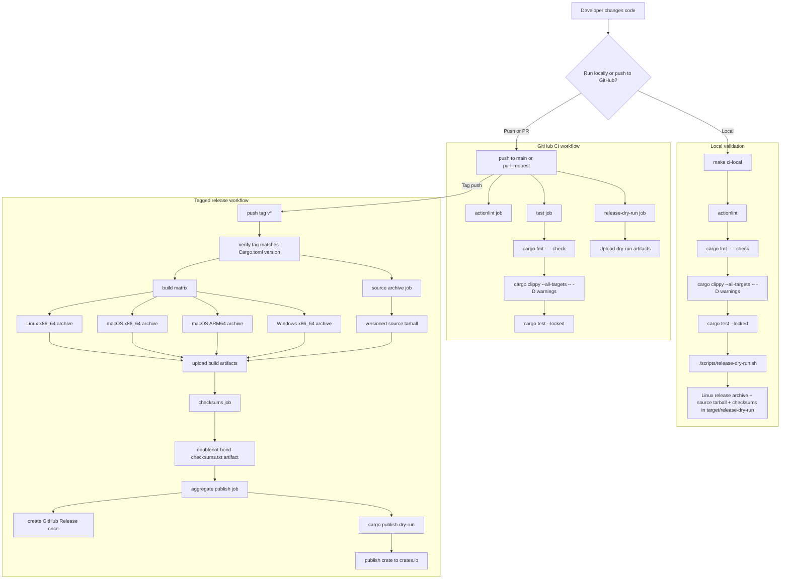
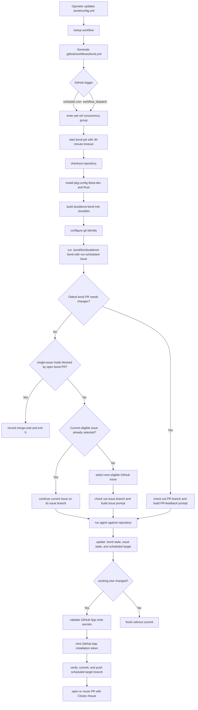
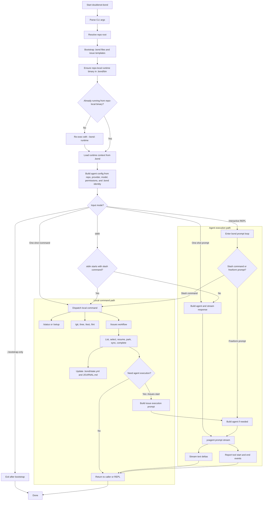

# Workflow Diagrams

This document captures the current validation, release, and scheduled automation flow for `doublenot-bond`.

## Validation And Release Flow

## Notes

- `make ci-local` is the closest local equivalent to the Linux CI path.
- The release dry-run now covers both Linux packaging and `cargo publish --dry-run --locked`.
- The tagged release workflow is the only path that publishes cross-platform archives, GitHub Release assets, and the crates.io crate.
- `make release-prep VERSION=X.Y.Z` is the local step that updates `Cargo.toml` before creating the matching `vX.Y.Z` tag.
- The Rust crate is published to crates.io, not GitHub Packages.

## Scheduled Bond Workflow

## Scheduled Workflow Notes

- The generated workflow builds from the checked-out repository source, stages the binary into `.bond/bin`, and runs that repo-local executable.
- New `.bond/config.yml` bootstrap output leaves `commands.test` and `commands.lint` as empty arrays with guidance comments, so operators must declare repo-specific verification commands before relying on `/test`, `/lint`, or scheduled verification.
- `automation.multiple_issues` defaults to `false`, which means the oldest open bond PR blocks new issue work until it is merged unless that PR currently has requested changes to address.
- During the scheduled run, the runtime selects and checks out the scheduled target branch itself. That target can be PR feedback work, merge-wait, or normal issue work.
- After the scheduled run, the workflow reads the persisted scheduled target metadata from `.bond/state.yml`, runs configured `commands.lint` and `commands.test` checks when there are changes to publish, validates the GitHub App secrets for the write path, mints an installation token, then stages tracked changes, commits them as `doublenot-bond[bot]`, pushes the selected branch, and opens or reuses a PR linked to the GitHub issue with `Closes #...`.
- Merge-wait scheduled runs exit successfully before verification and commit, even though they still record the pause state in `.bond` metadata.
- Cron, provider, and model are rendered from `.bond/config.yml` into `.github/workflows/bond.yml`.
- Provider API-key secret names are fixed by provider and match the runtime env lookup logic.
- Scheduled branch pushes and PR creation require `BOND_GITHUB_APP_ID` and `BOND_GITHUB_APP_PRIVATE_KEY` so the remote write actor is the configured GitHub App instead of `github-actions[bot]`.
- Generated workflows use a per-ref concurrency group and a 30-minute timeout to avoid overlapping scheduled runs on the same branch.
- `/setup workflow` preserves an existing `.github/workflows/bond.yml`; `/setup workflow refresh` overwrites it intentionally.

## Doublenot-Bond Runtime Flow

## Runtime Notes

- `.bond` is the runtime boundary for identity, personality, journal, config, state, and the repo-local executable.
- Slash commands can operate without external model credentials when they only use local repository operations.
- Issue workflows can either update local and GitHub state directly or hand off to the agent by generating an execution prompt.
